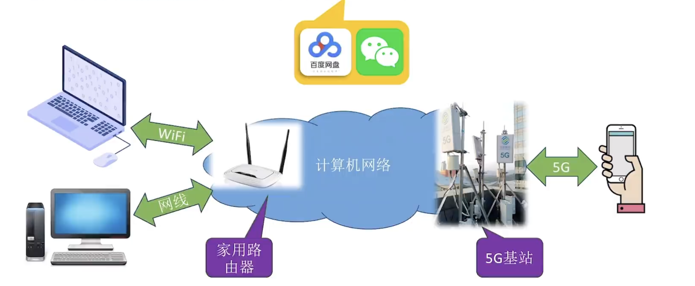
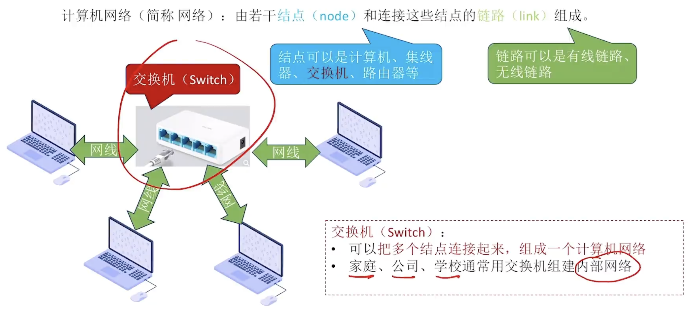
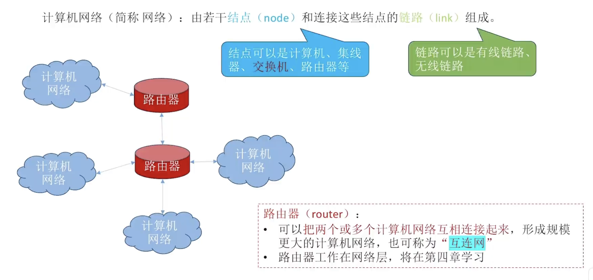
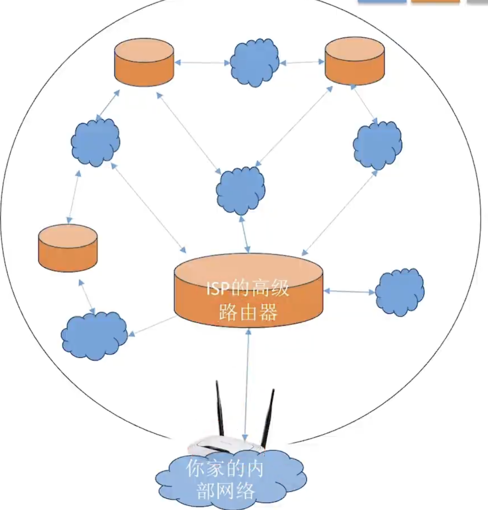

# 计算机网络

计算机网络（Computer Networking）：是一个将众多分散的、自治的计算机系统，通过通信设备和线路连接起来，由功能完善的软件实现资源共享和信息传递的系统。

## 层级关系

### 计算机网络内部

一个计算机网络内部由若干节点和连接这些节点的链路组成。

节点：计算机、**交换机 (switch)**、集线器 (hub)、**路由器 (routers)**

链路：有线链路、无线链路

### 互连网 (internet)

互连网：多个计算机网络组成起来的系统。

> 路由器 (router)：将多个计算机网络连接起来的的元件。

### 互联网 (Internet)

**互联网服务提供商 (ISP, Internet Service Provider)：将全世界范围的互连网连接起来的服务商，比如中国电信/移动/联通**。

互联网 (Internet)：由各大 ISP 和国际机构组建的，覆盖全球范围的互连网。

> [!NOTE]
>
> **互联网必须使用 TCP/IP 协议通信**，方便全球各个不同的 ISPs 来统一接口和通信。
>
> 互连网可以使用任何协议。

## 具体组成

计算机网络的具体组成：

- 主机 (end system)：PC 电脑、笔记本电脑、手机、服务器等等
- 通信链路 (communication link)：有线链路和无线链路，比如网线、光纤、同轴电缆等等
- 分组交换设备 (packet switch)：用于传送数据，比如交换机 (switch)、路由器 (router)
- 协议 (protocol)：规定计算机网络中的通信规则
- 软件 (app)：运行在设备上的服务

> 区别网络边缘 (network edge) 和网络核心 (network core)：
>
> network edge: 电脑、手机、服务器、智能家电等 end systems
>
> network core: 大量互联的路由器和高速链路
