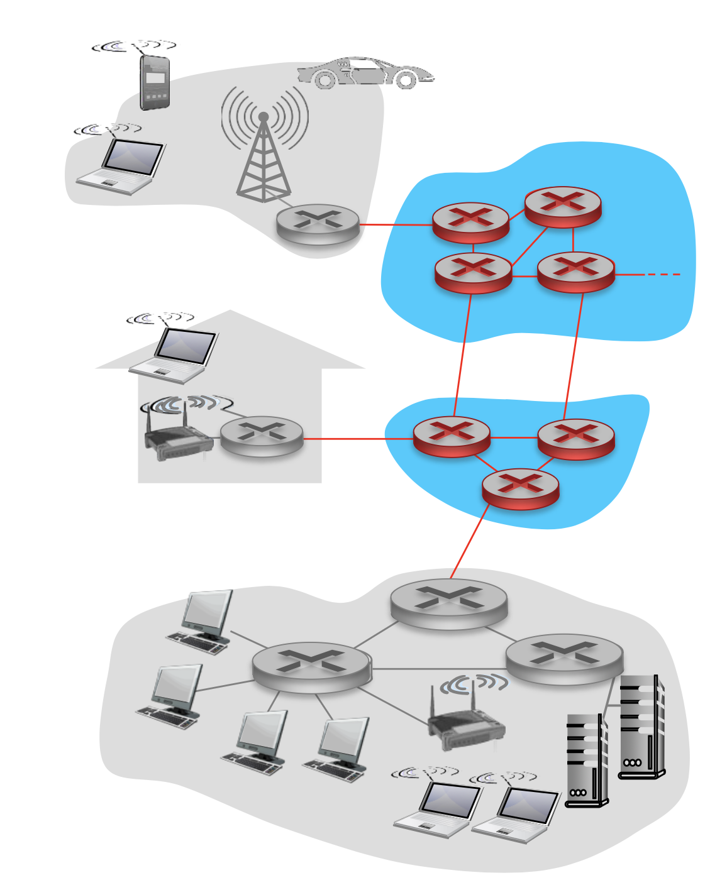
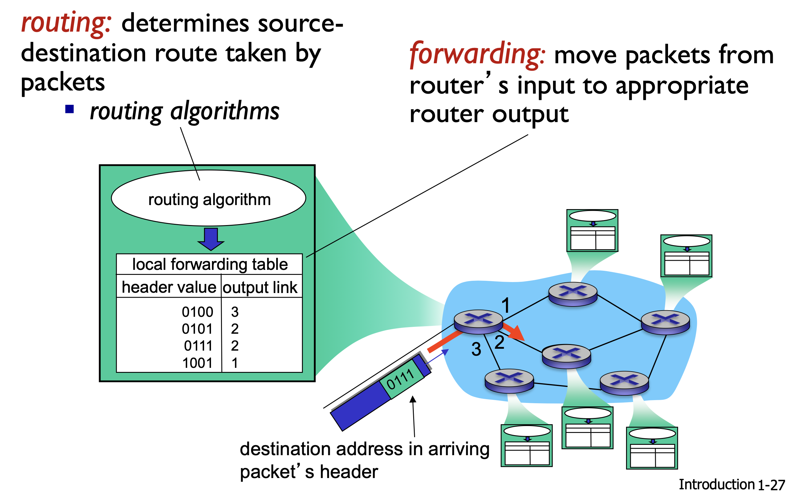
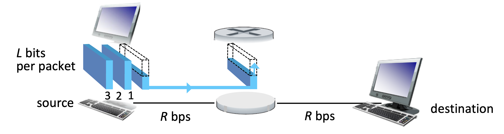
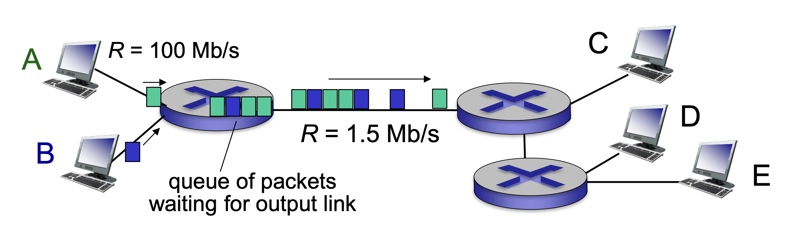
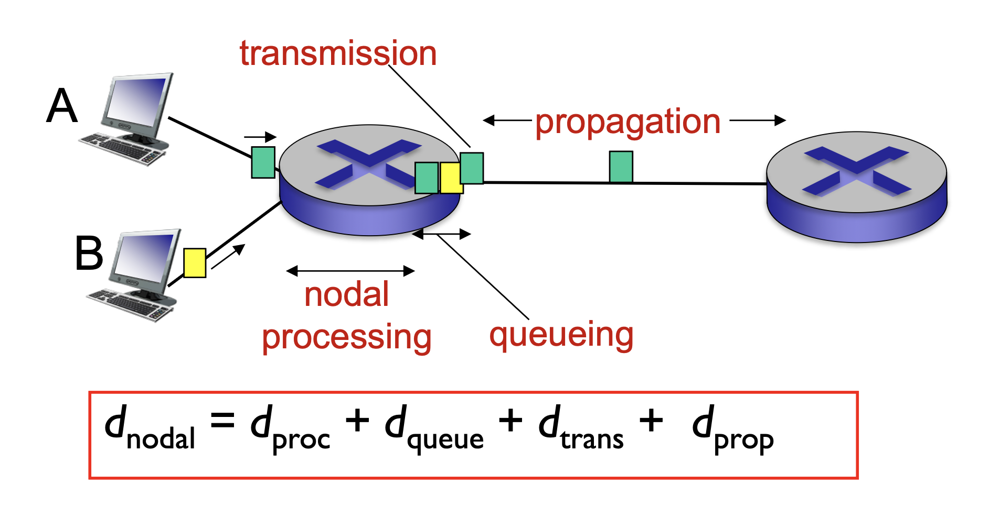
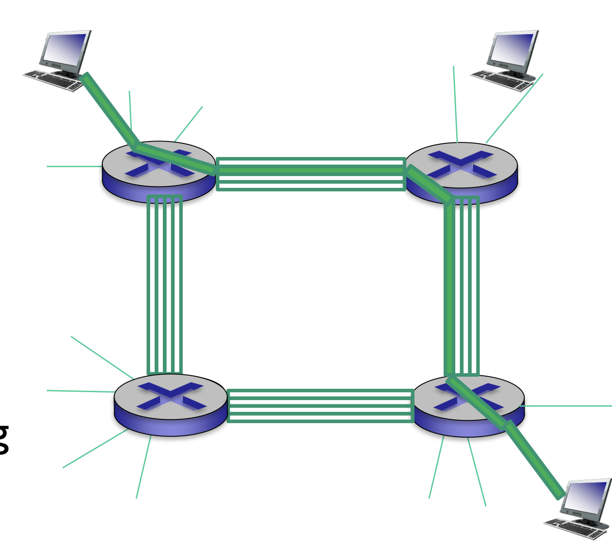
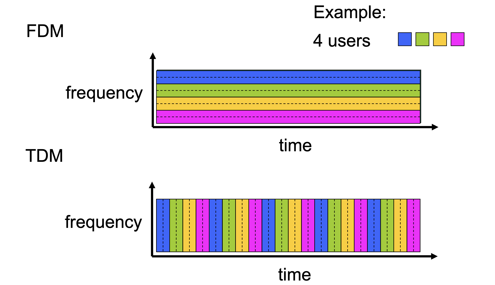

# 网络核心 (network core)

## 什么是网络核心

网络核心是由大量互相连接的路由器构成的网络。

```
源主机 → 路由器 → 路由器 → 路由器 → 目的主机
```



### 网络核心的两个核心功能

#### 路由 (routing)

Routing 决定 packet 从源主机到目的主机应该走哪一条完整路径。

```
源主机 → R1 → R3 → R7 → 目的主机
```

它回答的是：

> 从整体上看，应该经过哪些路由器？

路由器通过 **routing algorithm**（路由算法）交换网络信息，形成自己的转发表。

#### 转发 (forwarding)

Forwarding 是路由器收到一个 packet 后，根据**本地转发表**把它送到正确的输出端口。

```
packet 进入路由器
       ↓
检查目的地址
       ↓
查询 forwarding table
       ↓
从对应输出端口发出
```



## 分组交换 (packet switching)

主机会把应用产生的完整消息切分成多个 **packet（分组）**：

- 网络核心中的路由器负责将这些 packet 一跳一跳地转发到目的地

- 如果多个 packet 同时想使用同一条链路，它们必须排队

> 轮到某个 packet 使用链路时，它会以该链路的完整传输速率 \(R\) 发送。例如链路速率为 100 Mbps，这个 packet 被发送时就使用 100 Mbps，不会预先为每位用户固定分配一部分带宽。

### 存储转发 (Store-and-Forward )

传统分组交换常使用 **存储转发**：路由器必须先完整接收一个 packet，才能把它发送到下一条链路。

> 假设：
>
> - packet 长度为 \(L\) bits；
> - 链路传输速率为 \(R\) bits/s。
>
> 把整个 packet 推入一条链路需要：
>
> $d_{\text{trans}}=\frac{L}{R}$
>
> $L=7.5\text{ Mbits},\quad R=1.5\text{ Mbps}$​
>
> 所以一条链路的传输时延为：
>
> $\frac{7.5}{1.5}=5\text{ s}$​

如果源主机和目的主机之间有两条带宽相同的链路，中间有一个路由器：

```
源主机 ──链路1── 路由器 ──链路2── 目的主机
```

在忽略传播时延、排队时延和处理时延时：

$d_{\text{end-end}}=\frac{L}{R}+\frac{L}{R} =\frac{2L}{R}$

原因是路由器收到完整 packet 后，才能开始第二次传输。

如果路径有 \(N\) 条速率相同的链路，则单个 packet 的传输时延近似为：

$d_{\text{end-end}}=N\frac{L}{R}$



### 排队和丢包 (queueing delay and loss)

多个输入可能同时把 packet 发送给一个路由器，但输出链路的速率有限。

```
A、B 的数据 ──100 Mbps──→ 路由器 ──1.5 Mbps──→ C、D、E
```

前面的数据来得快，后面的输出链路却比较慢，于是 packet 会在路由器的 **buffer（缓存）**中排队。

> 输入链路和输出链路的带宽不同。

会产生两个结果：

- **Queueing delay（排队时延）**：packet 等待前面的 packet 发送完；
- **Packet loss（丢包）**：缓存已满时，新到达的 packet 无处存放，只能被丢弃。



### 传送时间

传送一个节点包括以下时间：

1. $d_{trans}$：将一个 packet 传送到 communication link 上的时间
2. $d_{prop}$：packet 在 communication link 上从一端传到另一端的时间
3. $d_{proc}$：进入路由器后对 packet 进行处理的时间，检查比特错误、决定输出端口等等
4. $d_{queue}$：排队进入路由器的时间，根据路由器拥堵程度决定



## 电路交换 (circuit switching)

除了 packet switching，另一种网络核心设计是 **circuit switching（电路交换）**。

在通信开始前，网络会为通信双方预留一条端到端的资源：

```
主机 A ═══预留线路资源═══ 主机 B
```

特点是：

- 带宽预先分配，其他用户不能使用已经预留的部分
- 性能比较稳定，即使用户暂时不发送数据，资源仍然保留
- 传统电话网络经常使用这种方式

例如每条链路被分成 4 个 circuit，一次电话连接会在路径经过的每条链路上占用一个 circuit。

> 优点是可以提供比较确定的带宽和时延。缺点是用户不发送数据时，预留资源会空闲，利用率较低。



### FDM and TDM

电路交换需要把链路资源分给不同用户，常见方法是 FDM 和 TDM。

#### FDM: Frequency Division Multiplexing

把链路的频率范围划分成多个频带，每个用户持续占用一个频带：

```
频率
高 ┌──────── 用户4
   ├──────── 用户3
   ├──────── 用户2
低 └──────── 用户1
              时间 →
```

即使某个用户暂时没数据，他的频带也通常不会给其他用户使用。

#### TDM: Time Division Multiplexing

让所有用户使用相同频率范围，但轮流占用不同时间片：

```
时间 → │用户1│用户2│用户3│用户4│用户1│……
```

区别是：

- FDM：同时传输，频率不同；
- TDM：频率可以相同，但时间不同。



## packet switching vs. circuit switching

假设：

- 总链路速率是 1Mbps
- 每个活跃用户需要 100kbps
- 每个用户只有 10% 的时间活跃

如果使用 circuit switching，则最多支持 $\frac{1Mbps}{100kbps} = 10$ 个用户。

如果使用 packet switching，以接入了 35 个用户为例，X 为同时活跃的用户，则：
$$
X\sim\operatorname{Binomial}(35,0.1)
$$

$$
P(X>10)\approx0.000424
$$

就算接入了 35 个用户，同时活跃超过 10 个用户的概率也非常非常小。

| Packet switching       | Circuit switching                  |
| ---------------------- | ---------------------------------- |
| 按需使用资源           | 提前预留资源                       |
| 适合突发性数据         | 适合持续、稳定的通信               |
| 资源利用率高           | 性能更容易保证                     |
| 通常不需要建立专用电路 | 通信前需要建立电路                 |
| 可能排队和丢包         | 一般不会因为其他用户突然活跃而排队 |
| 带宽和时延可能变化     | 带宽和时延较稳定                   |

网页浏览就是典型的 **bursty data（突发性数据）**：

```
发送网页请求 → 短时间大量接收数据 → 长时间阅读、不传数据
```

如果始终预留一条线路，大多数时间都会浪费，因此互联网主要使用 packet switching。

Packet switching 的代价是：拥塞时会发生延迟和丢包，需要可靠传输、重传和拥塞控制等协议。
